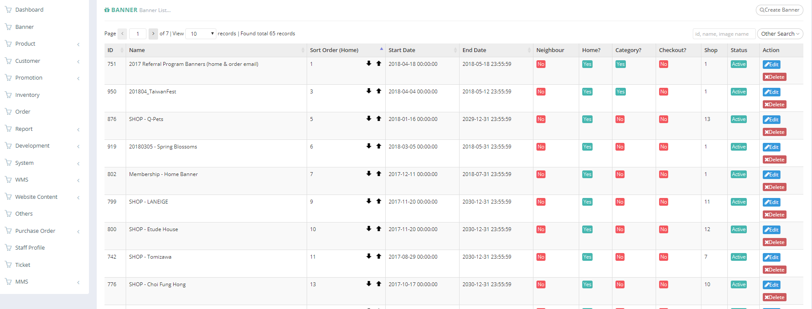

# Banner Module

| **FIELD NAME** | **FIELD DESCRIPTIONS** |
| --- | --- | --- | --- | --- | --- | --- | --- | --- | --- | --- | --- | --- |
| ID | The Banner ID |
| Name | The Name of the Banner |
| Sort Order \(Home\) | The Relative Importance of Home Banner Sorting |
| Start Date | The Starting Day of posting the banner on website |
| End Date | The Final Day of posting the banner on website |
| Neighbor | The field states that banner is only display for 'VIP' customers or not |
| Home? | "Yes" or "No" Banner on Home Page? |
| Category? | upload a banner and display it in your selected category page. You can select more than one category to display. |
| Checkout? | upload a banner and display it in different checkout pages. E.g. you can set the banner display in checkout/cart, checkout/address... |
| Shop | This banner group belongs to which shop. Almost banner group also belongs to Ztore. The home banner will be displayed in Home page [https://www.ztore.com](https://www.ztore.com). For other shop, e.g. 社企, the home banner will be displayed in shop landing page [https://www.ztore.com/tc/shop/group/Social-Enterprises](https://www.ztore.com/tc/shop/group/Social-Enterprises) |
| Status | Active/ Inactive Banner |
| Action | Edit - Edit Banner Item Information                          Delete - Delete Banner Item |

