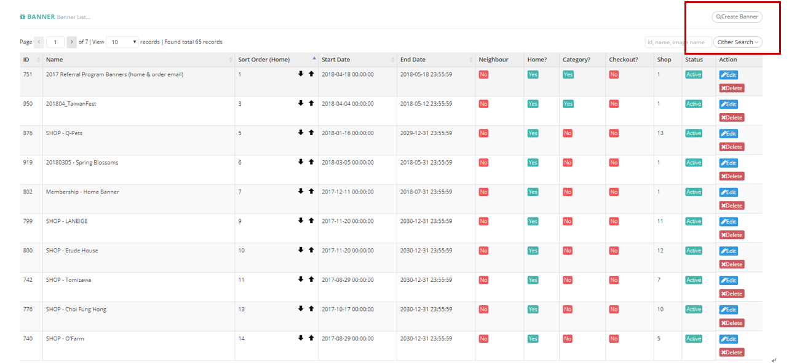

# Buttons

| **FIELD NAME** | **FIELD DESCRIPTIONS** |
| --- | --- | --- | --- |
| Create Banner | Users can create new Banner by inputting Banner details into the popup window |
| Other Search | User can filter Banner items by their status |
| Id, name, image name Input Box | User can carry out easy search by inputting Banner details into the Input Box |

