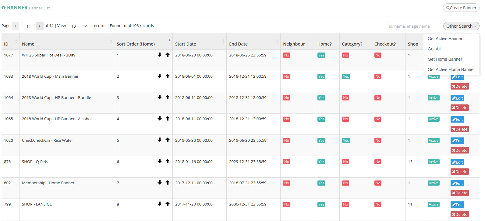

# Other Search

| **FIELD NAME** | **FIELD DESCRIPTIONS** |
| --- | --- | --- | --- | --- |
| Get Active Banner | Display Banner with “Active” Status |
| Get All | Display All Banner |
| Get Home Banner | Display all Home Banner Category Banner |
| Get Active Home Banner | Display all Home Banner Category with “Active” Status Banner. |

