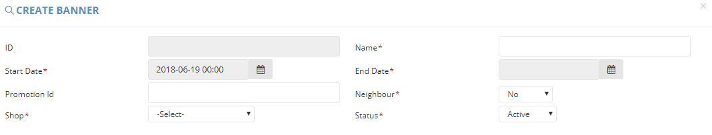

# Create Banner

| **FIELD NAME** | **FIELD DESCRIPTIONS** |
| --- | --- | --- | --- | --- | --- | --- | --- | --- |
| ID | The Banner ID |
| Name | The Name of the Banner |
| Start Date | The Starting Day of posting the banner on website |
| End Date | The Final Day of posting the banner on website |
| Promotion Id | The id of promotion which connects with this banner group. If set, the banner will be inactivated when the promotion end |
| Neighbor | The field states that banner is only display for 'VIP' customers or not |
| Shop | This banner group belongs to which shop. Almost banner group also belongs to Ztore. The home banner will be displayed in Home page [https://www.ztore.com](https://www.ztore.com). For other shop, e.g. 社企, the home banner will be displayed in shop landing page [https://www.ztore.com/tc/shop/group/Social-Enterprises](https://www.ztore.com/tc/shop/group/Social-Enterprises) |
| Status | Active or Inactive Banner |

