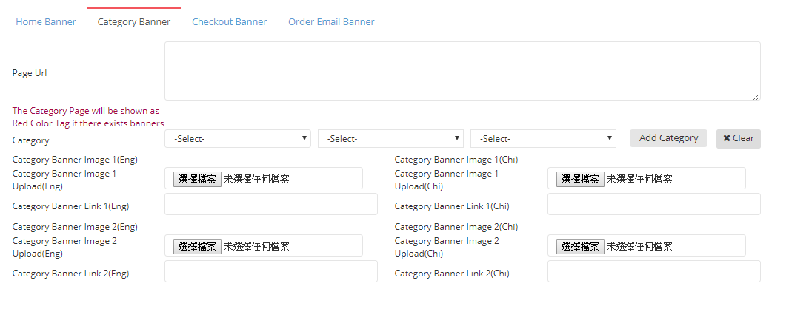

# Create Banner - Category Banner

| **FIELD NAME** | **FIELD DESCRIPTIONS** |
| --- | --- | --- | --- | --- | --- | --- | --- | --- | --- | --- |
| Page Url | The Link of Category Banner |
| Category | The Corresponding Category assigned to The Banner |
| Category Banner Image 1 Upload \(Eng\) | Upload The English Category Banner Image 1 Here |
| Category Banner Image 1 Upload \(Chi\) | Upload The Chinese Category Banner Image 1 Here |
| Category Banner Link 1 \(Eng\) | The Link of English Category Banner Image 1 |
| Category Banner Link 1 \(Chi\) | The Link of Chinese Category Banner Image 1 |
| Category Banner Image 2 Upload \(Eng\) | Upload The English Category Banner Image 2 Here |
| Category Banner Image 2 Upload \(Chi\) | Upload The Chinese Category Banner Image 2 Here |
| Category Banner Link 2 \(Eng\) | The Link of English Category Banner Image 2 |
| Category Banner Link 2 \(Chi\) | The Link of Chinese Category Banner Image 2 |

