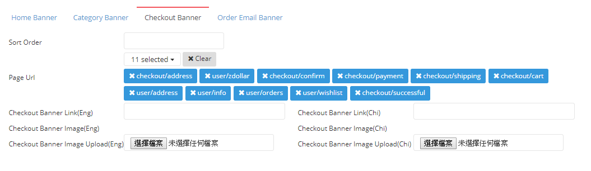

# Create Banner - Checkout Banner

| FIELD NAME | FIELD DESCRIPTIONS |
| --- | --- | --- | --- | --- | --- | --- |
| Sort Order | The Relative Importance of Checkout Banner |
| Page Url | The Link of Checkout Banner |
| Checkout Banner Link\(Eng\) | The Link of English Checkout Banner |
| Checkout Banner Link\(Chi\) | The Link of Chinese Checkout Banner |
| Checkout Banner Image Upload\(Eng\) | Upload The English Checkout Banner Image Here |
| Checkout Banner Image Upload\(Chi\) | Upload The Chinese Checkout Banner Image Here |

