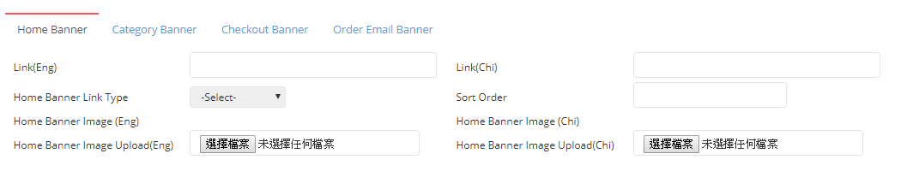

# Create Banner - Home Banner

| **FIELD NAME** | **FIELD DESCRIPTIONS** |
| --- | --- | --- | --- | --- | --- | --- |
| Link\(Eng.\) | The Link of English Home Banner |
| Link\(Chi\) | The Link of Chinese Home Banner |
| Home Banner Link Type | The home banner link is internal website or external website. Internal website: Browser will navigate to the ztore page using same browser tag \(example link: [https://www.ztore.com/tc/promotion/1003014](https://www.ztore.com/tc/promotion/1003014)\) External website: Browser will open a new browser tag to display the external website \(example link: [https://hk.shop.com/?tkr=s16776](https://hk.shop.com/?tkr=s16776)\) |
| Sort Order | The Relative Importance of Home Banner |
| Home Banner Image Upload\(Eng.\) | Upload The English Home Banner Image Here |
| Home Banner Image Upload\(Chi\) | Upload The Chinese Home Banner Image Here |

