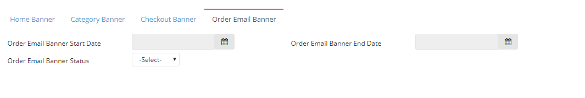

# Create Banner - Order Email Banner

| **FIELD NAME** | **FIELD DESCRIPTIONS** |
| --- | --- | --- | --- |
| Order Email Banner Start Date | The Starting Day of posting the Order Email Banner |
| Order Email Banner End Date | The Final Day of posting the Order Email Banner |
| Order Email Banner Status | Active or Inactive Order Email Banner |

